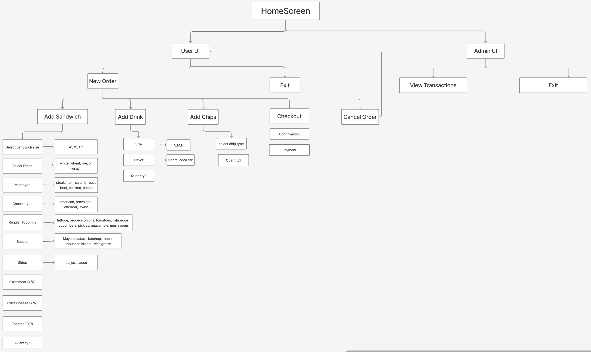

<!DOCTYPE html>
<html>
<body>
  <h1>DELI-cious Application</h1>
  

    This project is a digital Point of Sales (POS) system for <strong>DELI-cious</strong>, a custom sandwich shop.
    The goal is to replace the current paper-based order system with a simple and fast computer program.
  

  
  <h2>Class Diagram</h2>
  
Here is the class diagram for the system:

  
  

 
  <h2>User Flow Diagram</h2>
  
This diagram shows the user flow of UI:

  
  

</body>
</html>
