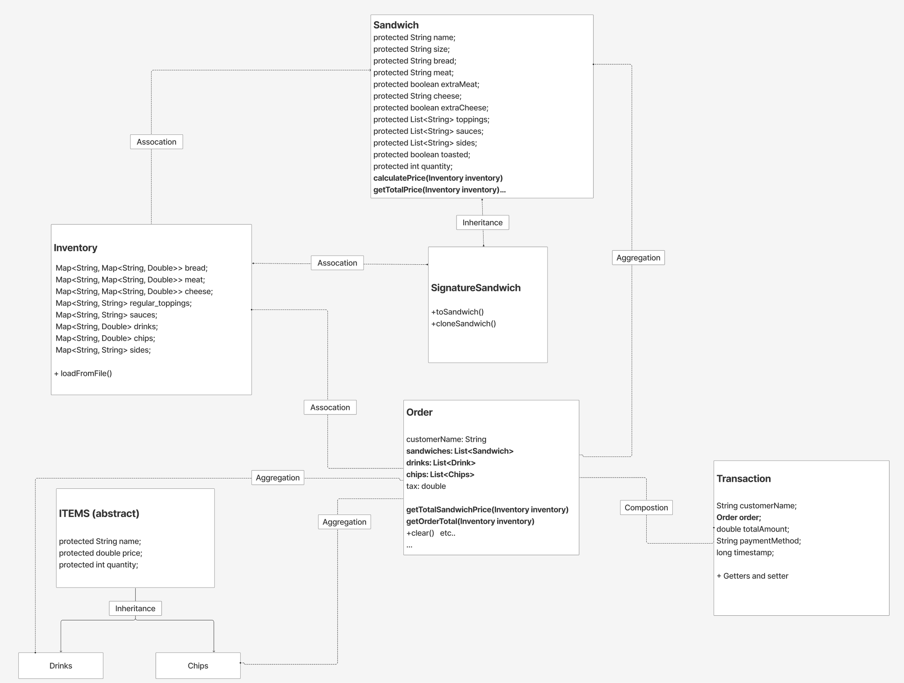
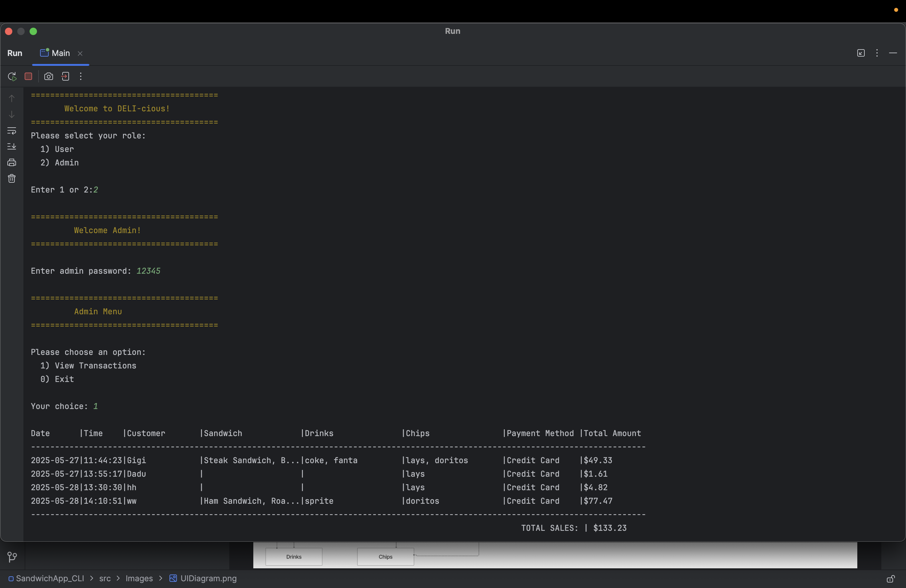
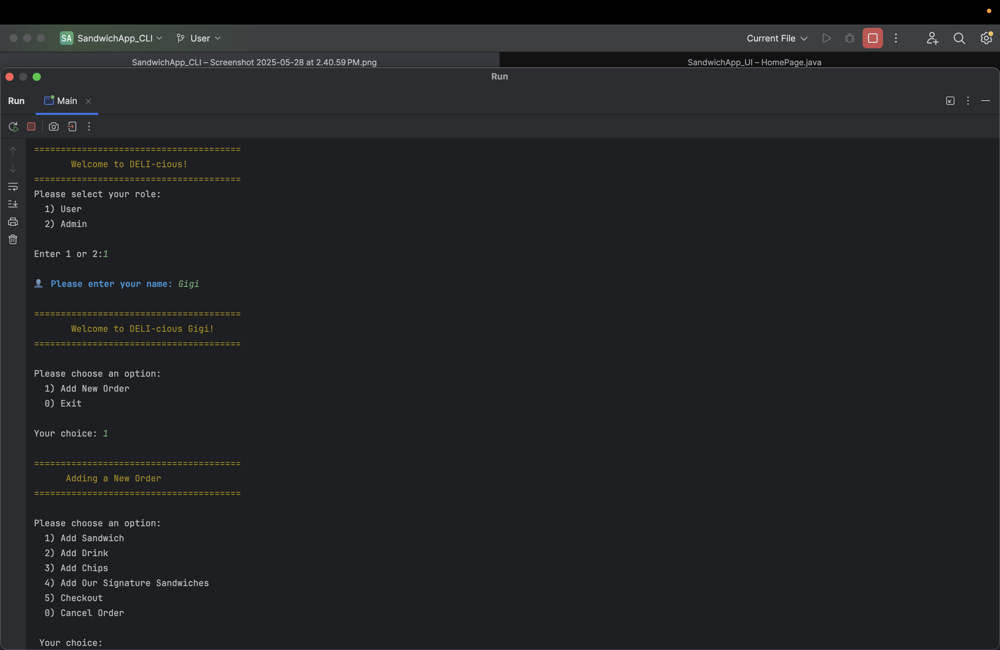
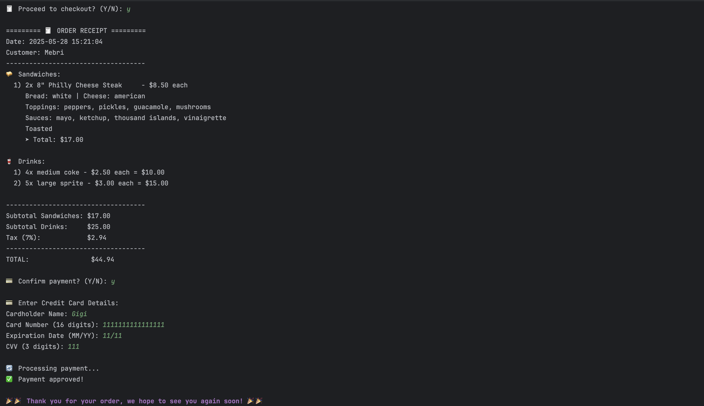
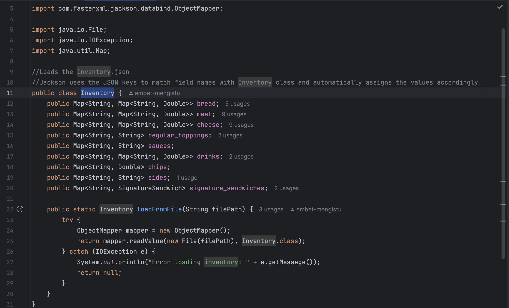
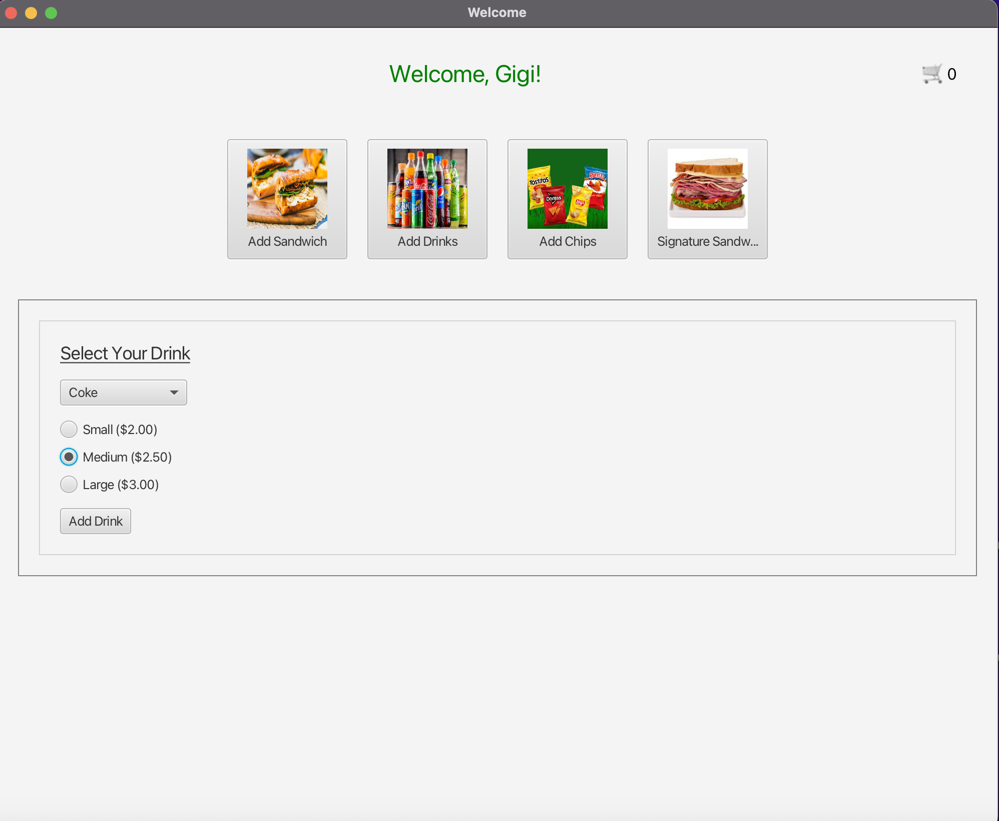
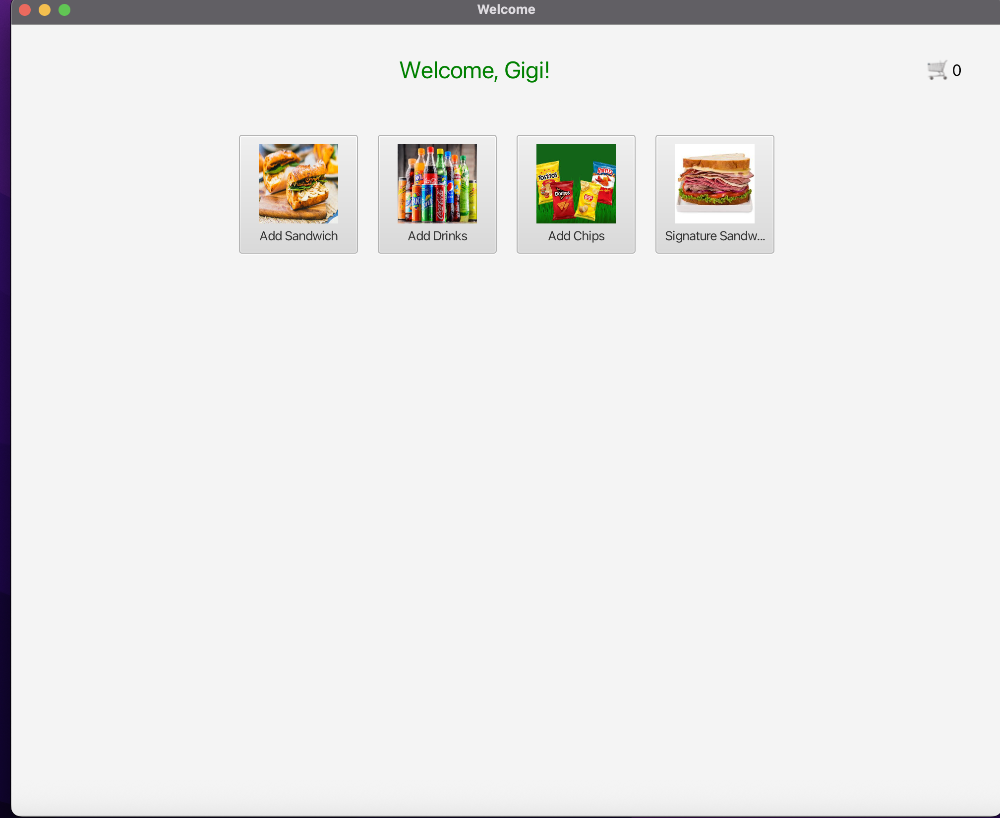
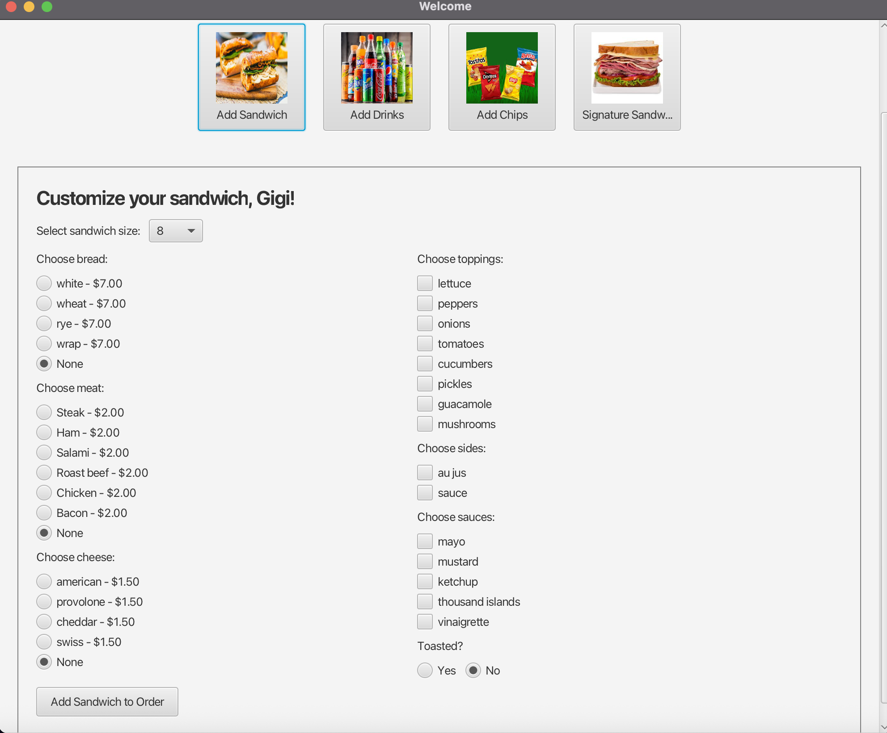
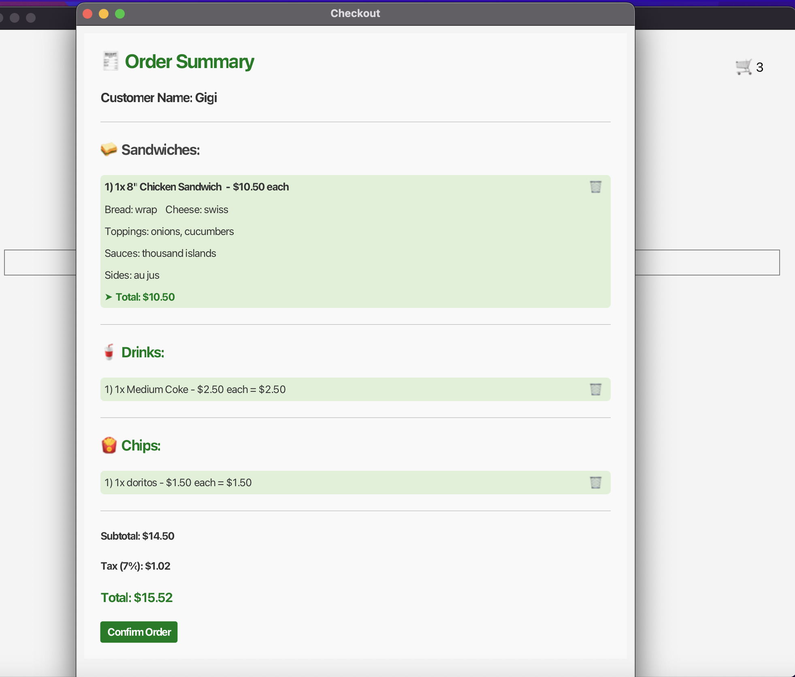

<!DOCTYPE html>
<html lang="en">
<head>
  <meta charset="UTF-8">
</head>
<body>
  <h1>🥪 DELI-cious Application</h1>

  This project is a digital Point of Sale (POS) system for <strong>DELI-cious</strong>, a custom sandwich shop. 
  The goal is to replace the existing paper-based order system with a faster and more efficient computer-based solution.

 
I have developed two versions of the Point of Sale (POS) system:

  <ul>
    <li>
      <strong>Command-Line Interface (CLI):</strong>
      <a href="https://github.com/Gigi-dev21/SandwichApp_CLI">Current GitHub</a>
    </li>
    <li>
      <strong>Graphical User Interface (GUI) using JavaFX:</strong>
      <a href="https://github.com/Gigi-dev21/SandwichApp_GUI">GUI Version GitHub Link</a>
    </li>
  </ul>

 
<h2>✅ Data Handling</h2>
<ul>
  <li>
    The inventory data is stored separately in its own JSON file.
  </li>
     
  <li>
    The application uses the Jackson JSON library to read both the transactions and inventory files, mapping the data into Java objects.
  </li>
   
  <li>
    When a customer places and confirms an order, the order details are saved as a transaction in a dedicated JSON file. Additionally, a separate text file is generated as 
    a receipt.
  </li>
     
  <li>
    This enables the system to dynamically load and display the current inventory as well as all recorded transactions.
  </li>
</ul>
 

  <h2>✅ User Flow Diagram</h2>
  
This diagram illustrates the user interface flow of the application:

  
   
  
  <h2>✅ Class Diagram</h2>
  
This diagram represents the class structure of the system:

  

  
  <h2>✅ Admin Home Page</h2>
  

    Access to this page requires a password.  
    After logging in, the admin can view all transactions in a table format, including total sales.
  

  

  

  <h2>✅ User Home Page</h2>
  

     Users must enter their name before continuing with the order process.
  

  

 

  <h2>✅ Checkout Page</h2>
  

     Once items are selected, the checkout page displays a summary of the order, the total cost and payment sytstem.
  

  
  
   

📷 More screenshots of the application’s screens can be found in the <code>images</code> folder.

  

 

  <h2>✅ Interesting piece of my code</h2>
  

   This class uses Jackson’s ObjectMapper to automatically read JSON keys and assign values to matching Java object properties. I find this interesting because it simplifies data binding, making it easy to load complex inventory data dynamically with minimal code.
  

     
  

   
  <h1>✅(GUI) using JavaFX</h1>
   
     <a href="https://github.com/Gigi-dev21/SandwichApp_GUI">GUI Version GitHub Link</a>
        
        
      
      
      
      
</body>
</html>
