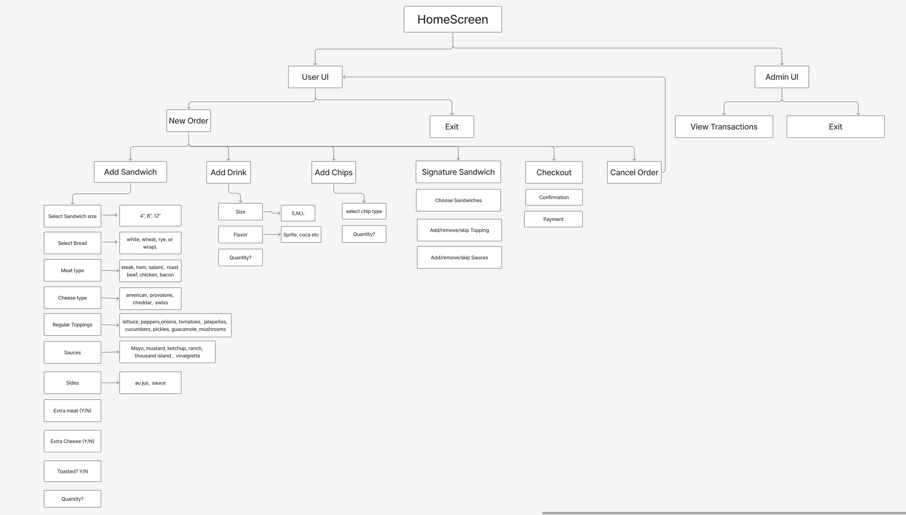

<!DOCTYPE html>
<html lang="en">
<head>
  <meta charset="UTF-8">
</head>
<body>
  <h1>🥪 DELI-cious Application</h1>
  

    This project is a digital Point of Sale (POS) system for <strong>DELI-cious</strong>, a custom sandwich shop.   
    The goal is to replace the existing paper-based order system with a faster and more efficient computer-based solution. 
  

  <h2>🧱 Class Diagram</h2>
  
This diagram represents the class structure of the system:

  

 

  <h2>🔄 User Flow Diagram</h2>
  
This diagram illustrates the user interface flow of the application:

  

 

  <h2>🔐 Admin Home Page</h2>
  

    🔑 Access to this page requires a password.  
    After logging in, the admin can view all transactions in a table format, including total sales.
  

  

  

  <h2>👤 User Home Page</h2>
  

    ✏️ Users must enter their name before continuing with the order process.
  

  

 

  <h2>💳 Checkout Page</h2>
  

    ✅ Once items are selected, the checkout page displays a summary of the order, the total cost and payment sytstem.
  

  
  

 
<h2>🗃️ Data Handling</h2>
<ul>
  <li>
    The inventory data is stored separately in its own JSON file.
  </li>
  
  <li>
    The application uses the Jackson JSON library to read both the transactions and inventory files, mapping the data into Java objects.
  </li>
  
  <li>
    When a customer places and confirms an order, the order details are saved as a transaction in a dedicated JSON file. Additionally, a separate text file is generated as 
    a receipt.
  </li>
  
  <li>
    This enables the system to dynamically load and display the current inventory as well as all recorded transactions.
  </li>
</ul>

</body>
</html>
